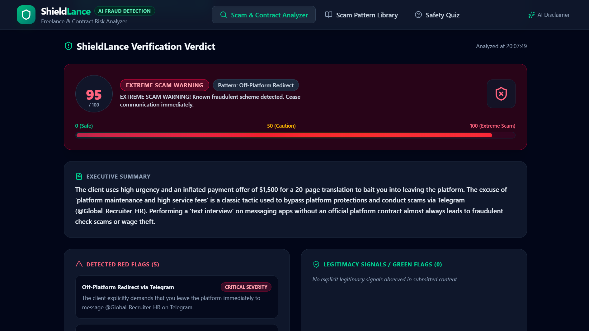
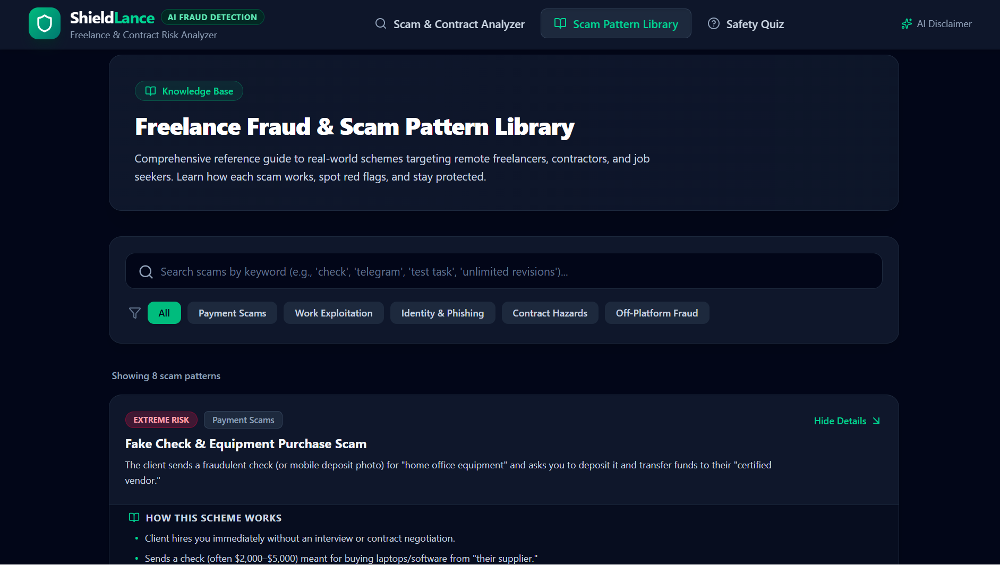
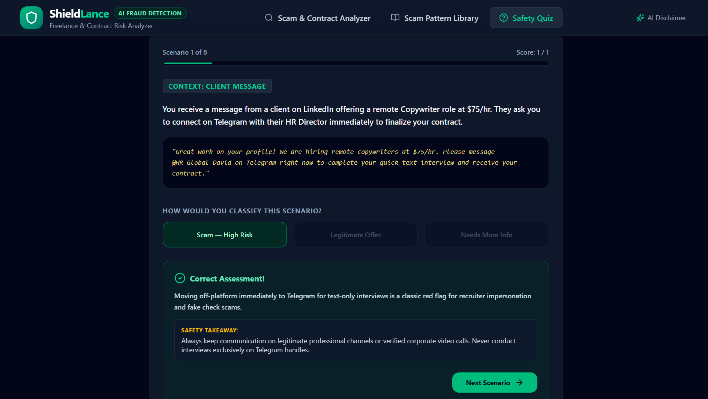

# 🛡️ ShieldLance — Freelance Scam & Contract Risk Analyzer

> **Protecting remote workers, freelancers, and independent contractors from fraudulent job offers, fake check schemes, off-platform traps, and predatory contract terms.**

🌐 **Live Deployed Application**: [https://shieldlance.netlify.app/](https://shieldlance.netlify.app/)

---

## 📌 Executive Summary & Problem Solved

### The Problem
Remote freelancing and digital contracting have seen an unprecedented rise in sophisticated fraud schemes:
- **Over $100M+ lost annually** by remote freelancers to fake check scams, equipment purchasing traps, and unpaid work exploitation.
- Bad actors leverage platforms like Upwork, Fiverr, LinkedIn, Telegram, and WhatsApp to pose as recruiters or clients.
- Freelancers—especially those early in their careers—frequently sign **predatory legal contracts** containing hidden non-competes, indefinite payment delays, and mandatory unlimited revision traps.

### The Solution
**ShieldLance** is a purpose-built AI-powered decision-support shield. Freelancers can paste suspicious job descriptions, client direct-messages, or contract clauses (or upload screenshots of client chats). ShieldLance's structured AI engine instantly evaluates the text against a taxonomy of freelance fraud patterns, providing:
1. A calibrated **0–100 Risk Score & Visual Meter**.
2. **Specific Pattern Classification** (e.g. *Fake Check Scam*, *Off-Platform Redirect*, *Unpaid Test Task*, *Predatory Terms*).
3. **Severity-Rated Red Flags & Legitimacy Green Flags**.
4. **Plain-Language Legal Clause Breakdown**.
5. **Ready-to-Send Non-Accusatory Client Reply Script**.

---

## 🔗 Live Application URL

- 🚀 **Production Deployment**: [https://shieldlance.netlify.app/](https://shieldlance.netlify.app/)
- ⚡ **Backend Architecture**: Netlify Serverless Functions (`/.netlify/functions/analyze`) with Gemini AI

---

## ✨ Comprehensive Features List

### 1. AI Core Analyzer (`/analyzer`)
- **Dual Input Modes**: Paste text up to 8,000 characters or upload screenshot images (PNG, JPEG, WEBP < 4MB) of client messages or contract PDFs.
- **Visual Risk Meter**: Dynamic 0–100 gauge with color-coded risk tiers:
  - `0–20`: Safe / Legitimate
  - `21–40`: Low Risk
  - `41–60`: Caution / Verification Advised
  - `61–80`: High Risk
  - `81–100`: Extreme Scam Warning
- **Preset Quick-Tests**: Instant one-click loading of realistic sample scenarios (Fake Check, Telegram Redirect, Predatory Contract, Legitimate Offer).
- **Executive Summary**: 2–4 sentence contextual summary explaining *why* the input was flagged.
- **Severity-Rated Red Flags**: Categorized into *Critical*, *High*, *Medium*, and *Low* severity with specific line-item explanations.
- **Legitimacy Signals (Green Flags)**: Balances analysis by identifying positive signals (e.g., escrow milestone mention, verified company domain, reasonable trial rate).
- **Predatory Contract Clause Detection**: Unpacks complex legalese into plain language (e.g., "Unlimited revisions without compensation", "Payment withheld indefinitely until client satisfaction").
- **Copyable Probing Reply**: Generates a professional, non-confrontational response to send back to the client to verify legitimacy without burning bridges.
- **Probing Questions List**: Key verification questions to ask the recruiter/client.
- **Recent Scan History**: Local session logging to compare previous scans.

### 2. Scam Pattern Library (`/library`)
- **Searchable Knowledge Base**: Searchable by keyword or filterable by category (*Payment Scams*, *Work Exploitation*, *Identity & Phishing*, *Contract Hazards*, *Off-Platform Fraud*).
- **In-Depth Pattern Guides**: Explains how each scheme works, real-world text examples, key red flags, and actionable prevention steps.

### 3. Interactive Safety Quiz (`/quiz`)
- **Instinct Training Engine**: Real-world interactive scenarios testing the user's ability to spot subtle red flags versus legitimate client offers.
- **Instant Explanations & Takeaways**: Explains why a scenario was a scam or legitimate, providing actionable takeaways.
- **Final Score Report**: Evaluates the user's fraud vigilance and provides recommended study areas.

### 4. AI Transparency & Legal Modal
- **Informed Usage Notice**: Clear transparency explaining AI decision-support scope, zero server-side logging of client data, and non-legal-advice disclaimers.

---

## 🤖 AI Feature Architecture & System Prompt

### What the AI Feature Does
The core intelligence is powered by **Google Gemini AI** via `@google/genai` with `gemini-2.5-flash`. The backend proxy passes user text or screenshot base64 images into a strict JSON Schema enforcer, ensuring zero hallucinated structures, guaranteed field presence, and deterministic response typing.

### Exact System Prompt Behind ShieldLance

```text
You are ShieldLance, a fraud-detection assistant specialized in freelance and remote-work scams. You analyze job posts, client messages, and contract text submitted by freelancers who want to know if something is a scam before they respond, accept work, or send money.

Your job:
1. Read the submitted text (or transcribed screenshot) carefully and look for concrete evidence — do not guess or use generic warnings unrelated to what was actually submitted.
2. Assign a risk score from 0 (completely safe) to 100 (extreme, near-certain scam) based on the specific signals present.
3. Map the score to a risk level: 0-20 Safe/Legitimate, 21-40 Low Risk, 41-60 Caution, 61-80 High Risk, 81-100 Extreme Scam Warning.
4. Identify the single most likely scam pattern from this list, or state "No Clear Pattern Detected" if none apply: Fake Check Scam, Off-Platform Redirect, Unpaid Test Task, Upfront Fee Request, Phishing for Personal Info, Overpayment Scam, Fake Client Identity, Predatory Contract Terms, Other (name it).
5. Write a plain-language summary (2-4 sentences) that references specific phrases or details from the submitted text.
6. List red flags actually present in the text, each with severity (Low, Medium, High, Critical) and a one-sentence explanation.
7. List green flags (legitimacy signals) actually present, if any.
8. If the text is or contains a contract/agreement, identify predatory clauses (e.g. unlimited revisions, vague or delayed payment terms, unfair IP assignment, one-sided cancellation rights, non-compete overreach) with plain-language explanations of why each is unfair to the freelancer.
9. Give 2-5 concrete recommended next steps appropriate to the risk level.
10. Write one ready-to-send suggested reply the freelancer could send to the client — professional, non-accusatory, designed to surface more information or set a boundary.
11. Write 2-4 specific probing questions the freelancer could ask the client to verify legitimacy.

Rules:
- Base every claim on the actual submitted content. Never fabricate details that are not present in the input.
- If the input is too short or vague to assess, say so honestly in the summary and lower confidence rather than inventing red flags.
- Be calibrated: do not mark everything as high risk. Many legitimate job posts and contracts exist — reward genuine legitimacy signals.
- Never ask the user for personally identifying information.
- Respond ONLY with valid JSON matching the exact schema provided. No prose outside the JSON, no markdown code fences.
```

---

## 🛠️ Tools, Services, & AI Models Used

| Layer | Technology / Tool | Description |
| :--- | :--- | :--- |
| **Frontend Framework** | React 18 + TypeScript | Component-driven UI architecture |
| **Styling & Layout** | Tailwind CSS v4 + Lucide Icons | Responsive dark theme with micro-interactions |
| **Build Tooling** | Vite 6 + esbuild | Ultra-fast bundling & ES module resolution |
| **AI Model** | `gemini-2.5-flash` | Google Gemini multimodal LLM for fast text & vision analysis |
| **AI SDK** | `@google/genai` | Official Google Gen AI TypeScript SDK |
| **Backend Execution** | Netlify Serverless Functions | Express-like Node runtime proxy (`/netlify/functions/analyze`) |
| **Hosting & Deployment** | Netlify | Global CDN hosting + automated serverless functions |

---

## 📷 Screenshots of the App in Action

### 1. Core AI Scam Analyzer & Visual Risk Meter

*Description: The central analysis interface showing the 0–100 Risk Score Meter, Pattern Classification, Severity-Rated Red Flags, Predatory Contract Terms breakdown, and Ready-to-Send Client Reply script.*

### 2. Freelance Scam Pattern Knowledge Library

*Description: Searchable knowledge database categorizing real-world schemes (Fake Check, Telegram Redirects, Unpaid Trials) with red flag lists and protection guidelines.*

### 3. Interactive Safety & Vigilance Quiz

*Description: Interactive scenario testing engine that presents real client communications, provides instant assessment feedback, and offers practical safety takeaways.*

---

## 🚀 How to Run the Project Locally

### Prerequisites
- **Node.js**: v18.0.0 or higher
- **npm**: v9.0.0 or higher
- **Google Gemini API Key**: Obtainable from [Google AI Studio](https://aistudio.google.com/)

### Step 1: Clone & Install Dependencies
```bash
git clone https://github.com/YOUR_USERNAME/shieldlance.git
cd shieldlance
npm install
```

### Step 2: Set Environment Variables
Create a `.env` file in the project root:
```env
GEMINI_API_KEY=your_actual_gemini_api_key_here
```

### Step 3: Launch Local Development Server
```bash
npm run dev
```
Open your browser at `http://localhost:3000`.

### Step 4: Build for Production
```bash
npm run build
```
The compiled static assets will be output to `dist/` and the serverless proxy bundle to `dist/server.cjs`.

---

## 🌐 Netlify Deployment Guide

1. Push your code to GitHub.
2. Link your repository in **Netlify**.
3. In Netlify Dashboard → **Site configuration** → **Environment variables**, set:
   - Key: `GEMINI_API_KEY`
   - Value: `[Your Gemini API Key]`
4. Trigger a deploy. Netlify will automatically detect `netlify.toml` and host the application at your custom URL.

---

© 2026 ShieldLance — Empowering Freelancers with AI Fraud Intelligence.
